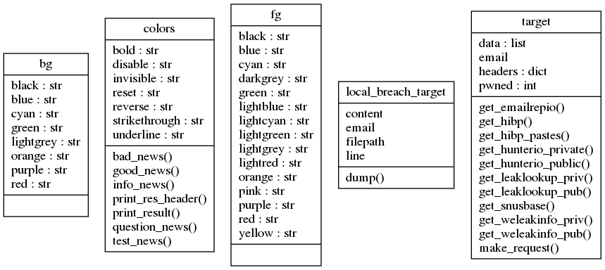
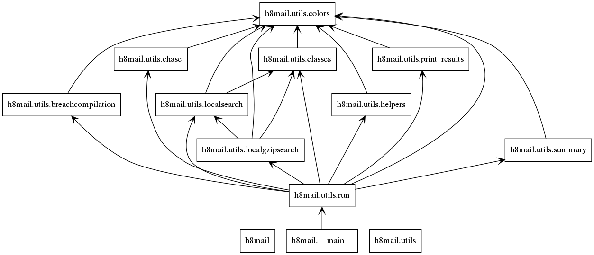

It has been over a year since h8mail is online, and the code base is starting to "stabilize". I'm starting new projects, so I'll try to explain how things work for future reference, or if someone is brave enough to consider making a pull request! :smile:

<!--more-->

- [h8mail files and folders](#h8mail-files-and-folders)
- [Code Diagrams](#code-diagrams)
      - [Classes](#classes)
      - [Packages](#packages)
- [Guidelines](#guidelines)


h8mail was, like most projects, just a script that evolved. We'll go over the files and folders first.

----

# h8mail files and folders

Let's run a recursive `ls` to get a good overview.

```
user@host ~ : git clone https://github.com/khast3x/h8mail.git
user@host ~ : cd h8mail
user@host ~/h8mail/ : ls -Rla

total 80
drwxrwxr-x  6 k    k     4096 jul. 12 02:23 ./
drwxrwxrwt 18 root root  4096 jul. 12 02:23 ../
-rw-rw-r--  1 k    k      167 jul. 12 02:23 config.ini
-rw-rw-r--  1 k    k      184 jul. 12 02:23 Dockerfile
-rw-rw-r--  1 k    k      292 jul. 12 02:23 .editorconfig
drwxrwxr-x  8 k    k     4096 jul. 12 02:23 .git/
drwxrwxr-x  2 k    k     4096 jul. 12 02:23 .github/
-rw-rw-r--  1 k    k     1216 jul. 12 02:23 .gitignore
drwxrwxr-x  3 k    k     4096 jul. 12 02:23 h8mail/
-rw-rw-r--  1 k    k     1501 jul. 12 02:23 LICENSE
-rw-rw-r--  1 k    k     1840 jul. 12 02:23 Makefile
-rw-rw-r--  1 k    k     1525 jul. 12 02:23 PyPi.rst
-rw-rw-r--  1 k    k    16086 jul. 12 02:23 README.md
-rw-rw-r--  1 k    k      390 jul. 12 02:23 setup.cfg
-rw-rw-r--  1 k    k     1460 jul. 12 02:23 setup.py
drwxrwxr-x  2 k    k     4096 jul. 12 02:23 tests/
-rw-rw-r--  1 k    k      388 jul. 12 02:23 .travis.yml

./.git:
        ++ snip ++
./h8mail:
total 24
drwxrwxr-x 3 k k 4096 jul. 12 02:23 ./
drwxrwxr-x 6 k k 4096 jul. 12 02:23 ../
-rw-rw-r-- 1 k k  137 jul. 12 02:23 __init__.py
-rw-rw-r-- 1 k k  645 jul. 12 02:23 __main__.py
-rw-rw-r-- 1 k k    9 jul. 12 02:23 requirements.txt
drwxrwxr-x 2 k k 4096 jul. 12 02:23 utils/

./h8mail/utils:
total 88
drwxrwxr-x 2 k k  4096 jul. 12 02:23 ./
drwxrwxr-x 3 k k  4096 jul. 12 02:23 ../
-rw-rw-r-- 1 k k  1477 jul. 12 02:23 breachcompilation.py
-rw-rw-r-- 1 k k   739 jul. 12 02:23 chase.py
-rw-rw-r-- 1 k k 16496 jul. 12 02:23 classes.py
-rw-rw-r-- 1 k k  6009 jul. 12 02:23 colors.py
-rw-rw-r-- 1 k k  4887 jul. 12 02:23 helpers.py
-rw-rw-r-- 1 k k     0 jul. 12 02:23 __init__.py
-rw-rw-r-- 1 k k  4991 jul. 12 02:23 localgzipsearch.py
-rw-rw-r-- 1 k k  5866 jul. 12 02:23 localsearch.py
-rw-rw-r-- 1 k k  2207 jul. 12 02:23 print_results.py
-rw-rw-r-- 1 k k  8215 jul. 12 02:23 run.py
-rw-rw-r-- 1 k k  1295 jul. 12 02:23 summary.py

./tests:
total 16
drwxrwxr-x 2 k k 4096 jul. 12 02:23 ./
drwxrwxr-x 6 k k 4096 jul. 12 02:23 ../
-rw-rw-r-- 1 k k   61 jul. 12 02:23 __init__.py
-rw-rw-r-- 1 k k  690 jul. 12 02:23 test_h8mail.py
```

h8mail is distributed using `pip`, which already comes with some folder layout restrictions.  
h8mail is *actually* an executable python module. As such, the actual h8mail code is found in the `h8mail/h8mail` folder.

Here is an overview of "what does what". References to code logic will make more sense as we go on.  

* `h8mail/` : home directory. Contains additional files such as a Dockerfile, a Makefile and setup.py for software distribution, the travis tests file (the `build:passing` badge), the `config.ini` template for h8mail.
* `h8mail/tests` : testing directory. Contains the files that describe how to test that this code version works.
* `h8mail/h8mail` : h8mail module directory. Contains the actual h8mail code, the `__main__.py` file calls the rest of the code in the `utils/` folder.
* `h8mail/h8mail/utils` : internal packages that runs everything.
  * `run.py` : Contains most of the h8mail logic. Handles target objects, and fills them with relevant data. Handles printing logic and saving to CSV.
  * `breachcompilation.py` : handles searching the BreachCompilation torrent using the `query.sh` script in the torrent. 
  * `print_results.py` : handles printing results in a formated table to the CLI.
  * `summary.py` : handles printing the final summary table using the list of target objects.
  * `colors.py` : handles all colors and formated CLI outputs, such as informational messages or errors.
  * `chase.py` : handles chasing targets (currently) using the hunter.io API. It will return a list of targets to append to the ongoing target list.
  * `localsearch.py & localgzipsearch.py` : handle the `-lb` and `-gz` options respectively. Multiprocessing logic is handled in their own files.
  * `classes.py` : contains the `target` object, and all the API methods to fill this object. It also contains the `local_breach_target` object, used when searching locally (with `-lb` & `-gz`). It will then be transformed to a `target` object and be appended to the on-going target list. Should be refactored one day.
  * `helpers.py` : contains other useful functions such as finding emails in files and writing to the CSV file.


Basically, `run.py` reads the user args and optionally the configuration file, and creates a list of `target` objects from user input of files.  
The `target` *object factory* calls `target` object methods depending on user choices and detected keys inside the configuration file.
Once APIs have been called, if the user specified local searching, h8mail will start calling the appropriate functions depending on the file type (cleartext or `tar.gz`).
Once that's done, h8mail will print a formatted table, a summary, and optionally save results as CSV.

----

# Code Diagrams

Now that we have a basic idea of how things run, here are the UML illustrations generated with `pyreverse`.

#### Classes

The `colors` class takes a bit space. You'll really want to be looking a the `target` and `local_breach_target` classes.



#### Packages

Hopefully, having read the previous blog segment will demystify the following diagram.



----

# Guidelines

Some of the guidelines I'm trying to keep:
* avoid requirements as much as possible. Hence the color class
* Code is formatted using [python black](https://github.com/python/black)
* API logic goes straight to the `target` class as a method
* Adding a new service requires adding it to the list of searched items in the printing functions
* Adding a new service requires adding to the methods called in `run.py`
* API logic is *per target*, whereas local searching is *per line*. All targets will be looked for in a single call for a single line for the local file search
* The code should stay cross-platform
* Readable python > intricate python